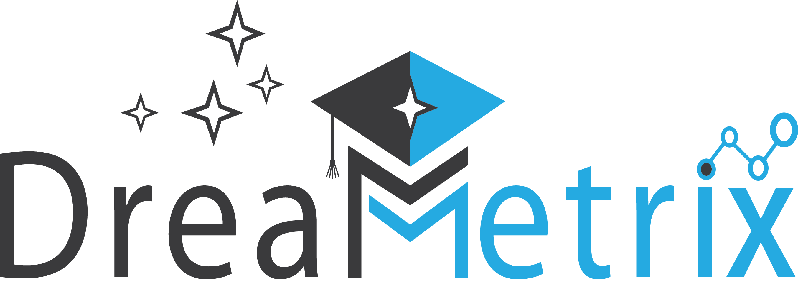

# DreaMetrix Educational Platform



DreaMetrix is a comprehensive educational platform designed for schools, teachers, students, and parents. It provides tools for classroom management, curriculum planning, assessment, and communication.

## Features

- **Multi-User Dashboards**: Role-specific interfaces for teachers, students, parents, and administrators
- **Classroom Management**: Attendance tracking, seating charts, and class rosters
- **Curriculum Tools**: Lesson planning, scope and sequence, unit planning
- **Assessment**: Gradebook, test preparation, polls, and assignments
- **Communication**: Messaging between teachers, students, and parents
- **AI Integration**: Activity suggestions, curriculum alignment verification, and tutoring

## Tech Stack

- **Frontend**: Next.js 14 with App Router
- **Language**: TypeScript
- **Styling**: Tailwind CSS with custom design system
- **State Management**: Redux Toolkit with Redux Persist
- **UI Components**: Radix UI primitives with custom styling
- **AI**: Google AI (Gemini) and OpenAI integration

## Getting Started

First, install dependencies:

```bash
npm install
# or
yarn install
# or
pnpm install
```

Then run the development server:

```bash
npm run dev
# or
yarn dev
# or
pnpm dev
# or
bun dev
```

To run both frontend and API server together:

```bash
npm run dev:all
# or
yarn dev:all
```

Open [http://localhost:3000](http://localhost:3000) with your browser to see the result.

### Troubleshooting

- **Redux-persist storage error**: If you see "redux-persist failed to create sync storage" in the console, this is expected during server-side rendering and won't affect functionality.
- **Missing fonts**: If custom fonts aren't loading, make sure you have an internet connection as they're loaded from Google Fonts.

## Design System

DreaMetrix uses a comprehensive design system to ensure consistency across the platform. The design system includes:

- **Color System**: Brand colors, semantic colors, and UI colors
- **Typography**: Font families, sizes, and weights
- **Components**: Buttons, cards, inputs, and more
- **Spacing**: Consistent spacing scale
- **Accessibility**: WCAG 2.1 AA compliance guidelines

For more details, see the [Design System Documentation](./DESIGN-SYSTEM.md).

## Project Structure

```
app/                # Next.js App Router pages
├── (auth)/         # Authentication pages
├── (dashboards)/   # Role-based dashboards
├── api/            # API routes
components/         # React components
├── ui/             # UI components
├── layout/         # Layout components
├── [feature]/      # Feature-specific components
redux/              # Redux store and slices
services/           # API services
hooks/              # Custom React hooks
utils/              # Utility functions
public/             # Static assets
```

## Development Guidelines

- Follow the design system for all UI components
- Use TypeScript for type safety
- Write accessible components
- Optimize for performance
- Write tests for critical functionality

## Learn More

To learn more about the technologies used in this project:

- [Next.js Documentation](https://nextjs.org/docs)
- [Tailwind CSS Documentation](https://tailwindcss.com/docs)
- [Redux Toolkit Documentation](https://redux-toolkit.js.org/)
- [Radix UI Documentation](https://www.radix-ui.com/)
